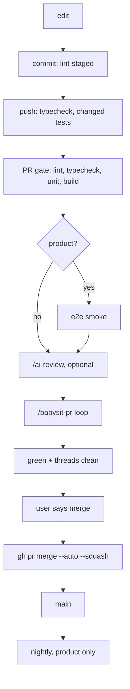
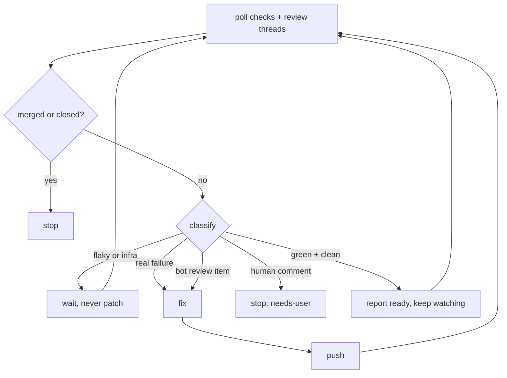

# Dev process

One verify config, three tiers, nested. Every Consumer declares a tier in `.skilly/config.json` and lists its checks as steps in `.skilly/verify.json`. Hooks and CI call `verify <stage>`, which reads the tier, skips stages above it, and skips steps whose target does not exist. `sandbox` is a subset of `tool`, `tool` a subset of `product`, so a product repo runs everything a sandbox repo runs.

## Tiers

| Stage                                                                        | sandbox | tool | product |
| ---------------------------------------------------------------------------- | :-----: | :--: | :-----: |
| pre-commit: `lint-staged`                                                    |   yes   | yes  |   yes   |
| pre-push: typecheck + `vitest run --changed origin/main`                     |   yes   | yes  |   yes   |
| PR gate: lint + typecheck + unit + build, one job                            |   yes   | yes  |   yes   |
| local `/code-review` on request; `/babysit-pr`                               |   yes   | yes  |   yes   |
| `/ai-review` PR comment runs `/code-review --comment` on the Max OAuth token |   no    | yes  |   yes   |
| required checks on `main` (GitHub Pro or Team)                               |   no    | yes  |   yes   |
| Dependabot alerts + `npm audit --audit-level=high` in the PR gate            |   no    | yes  |   yes   |
| PR gate: e2e smoke                                                           |   no    |  no  |   yes   |
| nightly: full e2e, dependency drift, security scan                           |   no    |  no  |   yes   |
| `/security-review` locally before release                                    |   no    |  no  |   yes   |

## Life of a change

## The babysit loop

Green plus clean is a milestone, not a terminal state: new review items still land. Terminal states are merged, closed, needs-user. Retry budget is 3.

## `.skilly/`

| File           | Holds                                                                                  |
| -------------- | -------------------------------------------------------------------------------------- |
| `config.json`  | tier and the Consumer's Bundles                                                        |
| `verify.json`  | stages `commit`, `push`, `ci`, `nightly`; steps with `why`, `budgetSeconds`, `extends` |
| `naming.json`  | overrides and exceptions for the `naming` Rule                                         |
| `writing.json` | overrides for the writing rules                                                        |

## Rules

- Keep every LLM out of every git hook. Hooks are deterministic and fast.
- Add a check as one line in `.skilly/verify.json`, never as a line in a hook or a workflow.
- Hold sandbox to the same code quality as product. The tier sets the size of the net, not the standard.
- Run review on request: `/code-review` locally, `/ai-review` as a PR comment on tool and product repos.
- Leave the merge to the user. Stop at green and report, per [workflow-sign-off](../.claude/rules/workflow-sign-off.md).
- Give the product tier its nightly and its security scan. Never gate a merge on either.

## Terms

`Consumer`, `Hub`, `Bundle`, `Rule`, `Skill` and `PR gate` are defined in [CONTEXT.md](../CONTEXT.md). Bundle layout is in [bundles.md](bundles.md).

The research behind these decisions lives outside the repo.
